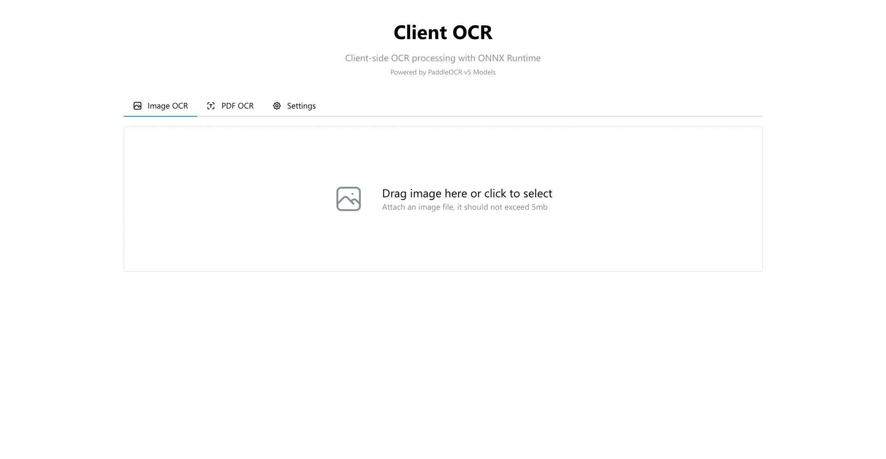
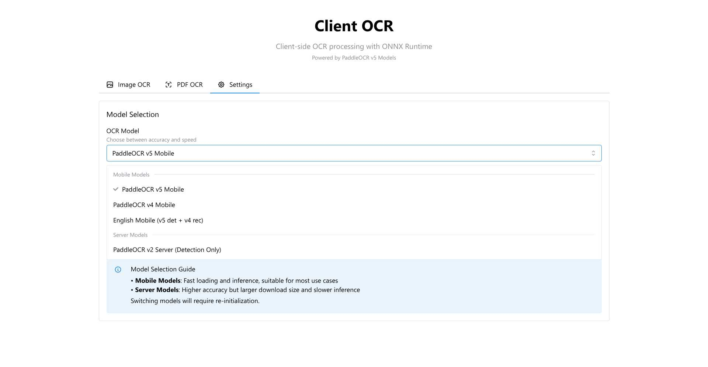
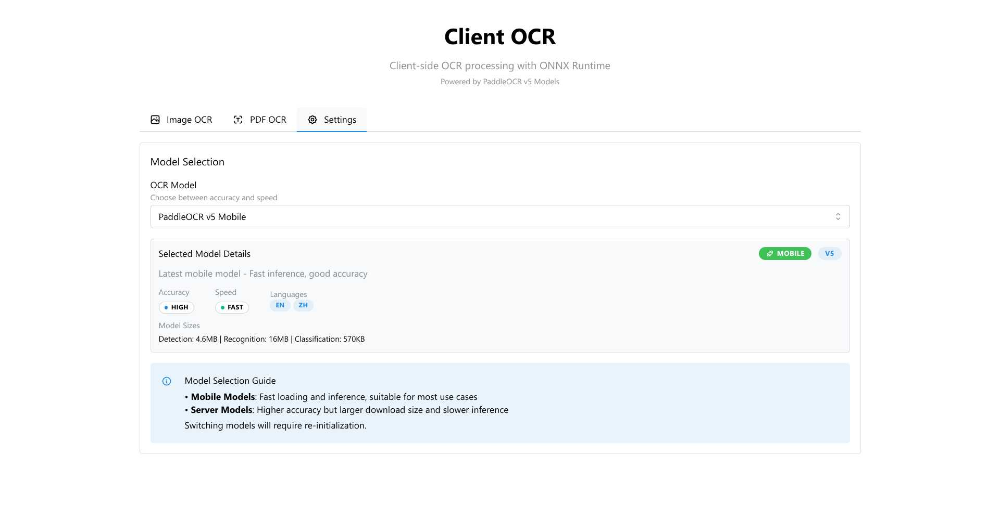
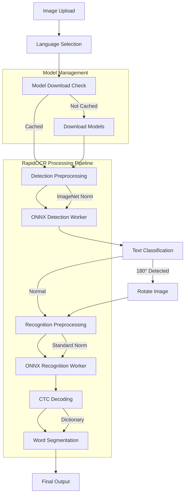

<div align="center">

# 🔍 Client-Side OCR with ONNX Runtime

**Extract text from images directly in your browser - no server required! Now with RapidOCR integration for 14+ languages!**

[](https://www.npmjs.com/package/client-side-ocr)
[](https://www.npmjs.com/package/client-side-ocr)
[](https://github.com/siva-sub/client-ocr/blob/main/LICENSE)
[](https://siva-sub.github.io/client-ocr/)
[](https://github.com/siva-sub/client-ocr)

[**Live Demo**](https://siva-sub.github.io/client-ocr/) | [**NPM Package**](https://www.npmjs.com/package/client-side-ocr) | [**Documentation**](./documentation/USAGE.md) | [**API Reference**](./documentation/API.md)

</div>

---

A high-performance, privacy-focused OCR solution that runs entirely in the browser using ONNX Runtime and RapidOCR models. Process text from images without sending data to any server - everything happens locally on your device. Now with RapidOCR integration supporting 100+ languages with state-of-the-art accuracy!

## 🚀 Why Choose Client-Side OCR?

### 🔒 **Complete Privacy & Security**
Unlike cloud-based OCR services (Google Vision, AWS Textract, Azure OCR), your sensitive documents **never leave your device**. Perfect for:
- 📄 Legal documents & contracts
- 💳 Financial statements & invoices  
- 🏥 Medical records
- 🆔 Personal IDs & passports
- 🔐 Confidential business documents

### 💰 **Zero Costs, Unlimited Usage**
- **No API fees**: Save thousands compared to cloud OCR services
- **No rate limits**: Process unlimited documents
- **No subscriptions**: One-time integration, lifetime usage
- **No surprises**: Predictable performance, no service outages

### ⚡ **Superior Performance**
- **Instant results**: No network latency (avg 300-1500ms)
- **Offline capable**: Works without internet after initial load
- **GPU acceleration**: Uses WebGL for faster processing
- **Batch optimization**: Process multiple regions efficiently

### 🎯 **How It's Different**

| Feature | Client-Side OCR | Cloud OCR (Google/AWS) | Tesseract.js |
|---------|----------------|------------------------|--------------|
| **Privacy** | ✅ 100% local | ❌ Data sent to servers | ✅ Local |
| **Cost** | ✅ Free forever | ❌ Pay per request | ✅ Free |
| **Languages** | ✅ 100+ built-in | ✅ Many | ⚠️ Manual setup |
| **Performance** | ✅ Fast (ONNX) | ⚠️ Network dependent | ❌ Slow |
| **Accuracy** | ✅ State-of-art | ✅ High | ⚠️ Good |
| **Setup** | ✅ Simple npm install | ❌ Complex API setup | ⚠️ Large models |
| **Preprocessing** | ✅ Built-in OpenCV | ⚠️ Limited | ❌ Basic |
| **Model Size** | ✅ 15-30MB total | N/A | ❌ 60MB+ per language |
| **Offline** | ✅ Full support | ❌ Requires internet | ✅ Supported |

### 🎨 **Advanced Features Not Found Elsewhere**
- 🖼️ **Smart Preprocessing**: Built-in OpenCV.js for image enhancement
- 🔄 **Auto-rotation**: Detects and corrects upside-down text
- 📊 **Confidence scores**: Get reliability metrics for each word
- 🔤 **Word segmentation**: Separate text into individual words
- 📱 **Mobile optimized**: Responsive design with camera capture
- 🚀 **Progressive Web App**: Install as native app on any device

## 🎯 Real-World Use Cases

### Perfect for Applications That Need:
- **📱 Document Scanner Apps**: Build mobile/web document scanners
- **🏢 Enterprise Document Processing**: Process sensitive documents securely
- **🏥 Healthcare Systems**: Extract text from medical records privately
- **🏛️ Government Portals**: Handle citizen documents without data leaks
- **📚 Education Platforms**: Convert handwritten notes to digital text
- **💼 Business Card Readers**: Extract contact information instantly
- **🧾 Receipt/Invoice Processing**: Automate expense tracking
- **📖 Digital Libraries**: Make scanned books searchable

## ✨ Core Features

- 🚀 **100% Client-Side**: All OCR processing happens in the browser - no data leaves your device
- 🎯 **High Accuracy**: Uses state-of-the-art RapidOCR and PaddleOCR v4/v5 models
- 🌍 **100+ Languages**: Support for major world languages including Chinese, English, Japanese, Korean, Arabic, Hindi, Tamil, and more
- 📱 **PWA Support**: Works offline after initial load with service worker caching
- 🖼️ **Image Preprocessing**: Built-in OpenCV.js for auto-enhancement, denoising, deskewing
- 🔄 **Auto-Rotation**: Automatically detects and corrects upside-down text
- 📄 **PDF Support**: Extract text from PDFs with native text layer detection
- 🎨 **Modern UI**: Beautiful, responsive interface built with React & Mantine UI
- 📦 **Smart Caching**: Models cached locally for instant subsequent use
- 🔧 **Developer Friendly**: Simple API, TypeScript support, React components
- 📊 **Performance Monitoring**: Real-time metrics and processing insights

## 👨‍💻 About the Author

**Sivasubramanian Ramanathan**

I created this module while experimenting and learning about extracting data from unstructured documents. What started as a curiosity about client-side OCR capabilities evolved into this comprehensive library that brings powerful text recognition to the browser.

<div align="center">

[](https://www.linkedin.com/in/sivasub987)
[](https://github.com/siva-sub)
[](mailto:hello@sivasub.com)
[](https://sivasub.com)

</div>

## Technology Stack

- **Frontend**: React 19 + TypeScript + Vite
- **UI Framework**: Mantine UI v8
- **OCR Engine**: ONNX Runtime Web
- **Models**: RapidOCR + PaddleOCR (PP-OCRv4/v5)
- **Processing**: RapidOCR techniques (CTC decoding, DB postprocessing)
- **PWA**: Vite PWA Plugin + Workbox

## Attribution & Credits

This project builds upon the excellent work of:

### 🏆 RapidOCR
- Repository: [https://github.com/RapidAI/RapidOCR](https://github.com/RapidAI/RapidOCR)
- Advanced OCR implementation with multi-language support
- Processing techniques and model hosting
- Licensed under Apache License 2.0

### 🏆 PaddleOCR
- Repository: [https://github.com/PaddlePaddle/PaddleOCR](https://github.com/PaddlePaddle/PaddleOCR)
- The state-of-the-art OCR models used in this application
- Licensed under Apache License 2.0

### 🔥 OnnxOCR
- Repository: [https://github.com/jingsongliujing/OnnxOCR](https://github.com/jingsongliujing/OnnxOCR)
- ONNX model conversion and inference implementation reference
- Provided the ONNX models and dictionary files

### 🚀 ppu-paddle-ocr
- Repository: [https://github.com/PT-Perkasa-Pilar-Utama/ppu-paddle-ocr](https://github.com/PT-Perkasa-Pilar-Utama/ppu-paddle-ocr)
- TypeScript implementation reference
- Deskew algorithm implementation inspiration

## 🚀 Demo

Try the live demo: [https://siva-sub.github.io/client-ocr/](https://siva-sub.github.io/client-ocr/)

## 💡 Quick Comparison

```javascript
// ❌ Cloud OCR (Privacy Risk + Costs)
const result = await fetch('https://api.service.com/ocr', {
  method: 'POST',
  body: formData, // Your sensitive data leaves your device!
  headers: { 'API-Key': 'sk-xxxxx' } // Costs money per request
});

// ❌ Tesseract.js (Slow + Large)
const worker = await Tesseract.createWorker('eng'); // 60MB+ download
const { data } = await worker.recognize(image); // Slow processing

// ✅ Client-Side OCR (Private + Fast + Free)
import { RapidOCREngine } from 'client-side-ocr';
const ocr = new RapidOCREngine({ lang: 'en' }); // 15MB total
await ocr.initialize(); // One-time setup
const result = await ocr.process(imageData); // Fast, local, private!
```

## 📦 Installation

<div align="center">

### Install from NPM

```bash
npm install client-side-ocr
```

```bash
yarn add client-side-ocr
```

```bash
pnpm add client-side-ocr
```

[](https://www.npmjs.com/package/client-side-ocr)

</div>

### For Development

```bash
# Clone the repository
git clone https://github.com/siva-sub/client-ocr.git
cd client-ocr

# Install dependencies
npm install

# Run development server
npm run dev

# Build for production
npm run build
```

## Quick Start

### As a Library

```typescript
import { createOCREngine } from 'client-side-ocr';

// Initialize the OCR engine with language selection
const ocr = createOCREngine({
  language: 'en', // or 'ch', 'fr', 'de', 'ja', 'ko', etc.
  modelVersion: 'PP-OCRv4' // or 'PP-OCRv5'
});
await ocr.initialize();

// Process an image with advanced options
const result = await ocr.processImage(imageFile, {
  enableWordSegmentation: true,
  returnConfidence: true
});
console.log(result.text);
console.log(result.confidence);
console.log(result.wordBoxes); // Word-level bounding boxes
```

### React Component

```tsx
import { RapidOCRInterface } from 'client-side-ocr/react';

function App() {
  return (
    <RapidOCRInterface 
      defaultLanguage="en"
      modelVersion="PP-OCRv4"
      onResult={(result) => console.log(result)}
    />
  );
}
```

### Via CDN

```html
<script type="module">
  import { createOCREngine } from 'https://unpkg.com/client-side-ocr@latest/dist/index.mjs';
  
  const ocr = createOCREngine();
  await ocr.initialize();
</script>
```

## Documentation

### 📚 Comprehensive Guides

- **[Usage Guide](./documentation/USAGE.md)** - Complete usage documentation with examples
- **[API Reference](./documentation/API.md)** - Detailed API documentation
- **[Model Documentation](./MODELS.md)** - Information about available OCR models

### 📸 Screenshots

| Home Page | Model Selection | Settings |
|-----------|-----------------|----------|
|  |  |  |

## API Overview

```typescript
// Create RapidOCR engine
const ocr = createRapidOCREngine({
  language: 'en', // 'ch', 'fr', 'de', 'ja', 'ko', 'ru', 'pt', 'es', 'it', 'id', 'vi', 'fa', 'ka'
  modelVersion: 'PP-OCRv4', // or 'PP-OCRv5'
  modelType: 'mobile' // or 'server'
});

// Initialize with automatic model download
await ocr.initialize();

// Process image with RapidOCR techniques
const result = await ocr.processImage(file, {
  enableTextClassification: true,  // 180° rotation detection
  enableWordSegmentation: true,     // Word-level boxes
  preprocessConfig: {
    detectImageNetNorm: true,       // ImageNet normalization for detection
    recStandardNorm: true           // Standard normalization for recognition
  },
  postprocessConfig: {
    unclipRatio: 2.0,              // Text region expansion
    boxThresh: 0.7                  // Box confidence threshold
  }
});

// Access enhanced results
console.log(result.text);           // Extracted text
console.log(result.confidence);     // Overall confidence
console.log(result.lines);          // Text lines with individual confidence
console.log(result.wordBoxes);      // Word-level segmentation
console.log(result.angle);          // Detected text angle (0° or 180°)
console.log(result.processingTime); // Processing time breakdown by stage
```

For detailed API documentation, see [API Reference](./docs/API.md).

## Model Support

The library supports RapidOCR models with multi-language capabilities:

### Supported Languages (14+)

| Language | Code | PP-OCRv4 | PP-OCRv5 | Notes |
|----------|------|----------|------------|-------|
| Chinese | ch | ✅ | ✅ | Simplified & Traditional |
| English | en | ✅ | ✅ | Full support |
| French | fr | ✅ | ❌ | PP-OCRv4 only |
| German | de | ✅ | ❌ | PP-OCRv4 only |
| Japanese | ja | ✅ | ✅ | Hiragana, Katakana, Kanji |
| Korean | ko | ✅ | ✅ | Hangul support |
| Russian | ru | ✅ | ❌ | Cyrillic script |
| Portuguese | pt | ✅ | ❌ | Brazilian & European |
| Spanish | es | ✅ | ❌ | Latin American & European |
| Italian | it | ✅ | ❌ | PP-OCRv4 only |
| Indonesian | id | ✅ | ❌ | PP-OCRv4 only |
| Vietnamese | vi | ✅ | ❌ | With tone marks |
| Persian | fa | ✅ | ❌ | Right-to-left support |
| Kannada | ka | ✅ | ❌ | Indic script support |

### Model Specifications

| Model Component | Size | Purpose | Features |
|----------------|------|---------|----------|
| Detection | 4-5MB | Text region detection | DB algorithm with unclip expansion |
| Recognition | 8-17MB | Text recognition | CTC decoding with embedded dictionary |
| Classification | 0.5MB | Text angle detection | 0° and 180° rotation correction |

### Model Architecture

- **Detection Models**: Uses DB (Differentiable Binarization) algorithm with:
  - ImageNet normalization (mean=[0.485, 0.456, 0.406], std=[0.229, 0.224, 0.225])
  - Dynamic resolution adjustment (multiples of 32)
  - Unclip ratio for text region expansion
  
- **Recognition Models**: Features include:
  - CTC (Connectionist Temporal Classification) decoding
  - Embedded dictionaries in model metadata
  - Dynamic width calculation based on aspect ratio
  - Standard normalization ((pixel/255 - 0.5) / 0.5)
  
- **Classification Models**: Text orientation detection:
  - Detects 0° and 180° rotations
  - Batch processing with aspect ratio sorting
  - Automatic rotation correction

### RapidOCR Integration

All models are hosted on RapidOCR's ModelScope repository and include:
- Meta ONNX models with embedded character dictionaries
- SHA256 checksums for integrity verification
- Automatic model downloading with progress tracking
- Efficient caching for offline use

## Architecture



## Performance

### Processing Speed
- Average processing time: 300-1500ms (depending on image size, language, and device)
- Batch processing optimization for multiple text regions
- Aspect ratio sorting for efficient recognition batching

### Optimizations
- WebGL backend for GPU acceleration when available
- Web Workers for non-blocking parallel processing
- Automatic model caching with SHA256 verification
- Smart preprocessing pipeline selection based on model type
- Efficient memory management with typed arrays

### Advanced Features
- **Word-level segmentation**: Separates Chinese characters from English/numbers
- **Confidence scoring**: Per-character and per-line confidence metrics
- **Rotation detection**: Automatic 180° text correction
- **Dynamic resolution**: Adaptive image resizing for optimal accuracy

## Browser Support

- Chrome/Edge 90+ (recommended)
- Firefox 89+
- Safari 15+
- Requires WebAssembly and Web Workers support

## Development

### Project Structure
```
client-ocr/
├── src/
│   ├── core/           # OCR engine and services
│   ├── workers/        # Web Workers for processing
│   ├── ui/            # React components
│   └── types/         # TypeScript definitions
├── public/
│   └── models/        # ONNX models and dictionaries
└── .github/
    └── workflows/     # GitHub Actions for deployment
```

### Key Components
- `RapidOCREngine`: Main OCR orchestrator with multi-language support
- `DetPreProcess`: Detection preprocessing with ImageNet normalization
- `RecPreProcess`: Recognition preprocessing with dynamic width calculation
- `ClsPreProcess`: Classification preprocessing for rotation detection
- `CTCLabelDecode`: CTC decoding with word segmentation
- `DBPostProcess`: DB postprocessing with unclip expansion
- `ModelDownloader`: Automatic model fetching from RapidOCR repository
- `ONNXMetadataExtractor`: Extract embedded dictionaries from models

## 🤝 Contributing

Contributions are welcome! Please feel free to submit a Pull Request.

## 📄 License

MIT License - see [LICENSE](LICENSE) file for details

## 🙏 Acknowledgments

Special thanks to:
- The RapidAI team for RapidOCR and model hosting
- The PaddlePaddle team for creating PaddleOCR
- The OnnxOCR project for ONNX conversion tools
- The ppu-paddle-ocr team for TypeScript implementation reference
- The open-source community for making this possible

## 🚀 What's New in v2.0

- **RapidOCR Integration**: Complete integration with RapidOCR processing pipeline
- **14+ Language Support**: Added support for multiple languages beyond English and Chinese
- **Advanced Processing**: CTC decoding, DB postprocessing, and word segmentation
- **Model Auto-Download**: Automatic model fetching with progress tracking
- **Embedded Dictionaries**: Models now include character dictionaries in metadata
- **Improved Accuracy**: Better preprocessing with proper normalization techniques
- **Batch Optimization**: Aspect ratio sorting for efficient batch processing

---

<div align="center">

Made with ❤️ by [Sivasubramanian Ramanathan](https://sivasub.com)

[](https://www.npmjs.com/package/client-side-ocr)
[](https://github.com/siva-sub/client-ocr)

</div>