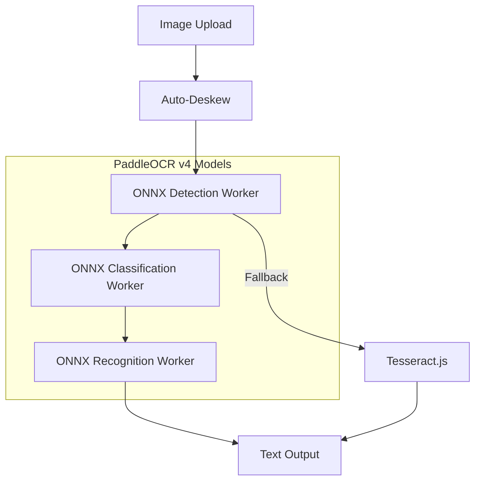

<div align="center">

# 🔍 Client-Side OCR with ONNX Runtime

**Extract text from images directly in your browser - no server required!**

[](https://www.npmjs.com/package/client-side-ocr)
[](https://www.npmjs.com/package/client-side-ocr)
[](https://github.com/siva-sub/client-ocr/blob/main/LICENSE)
[](https://siva-sub.github.io/client-ocr/)
[](https://github.com/siva-sub/client-ocr)

[**Live Demo**](https://siva-sub.github.io/client-ocr/) | [**NPM Package**](https://www.npmjs.com/package/client-side-ocr) | [**Documentation**](./docs/USAGE.md) | [**API Reference**](./docs/API.md)

</div>

---

A high-performance, privacy-focused OCR solution that runs entirely in the browser using ONNX Runtime and PaddleOCR models. Process text from images without sending data to any server - everything happens locally on your device.

## 🤔 Why Client-Side OCR?

- **🔒 Privacy First**: Your sensitive documents never leave your device
- **⚡ No Server Costs**: Zero API fees, no rate limits, no downtime
- **🌐 Works Offline**: Once loaded, works without internet connection
- **🚀 Fast Processing**: No network latency - instant results
- **🎯 Full Control**: You own the entire OCR pipeline

## ✨ Features

- 🚀 **100% Client-Side**: All OCR processing happens in the browser - no data leaves your device
- 🎯 **High Accuracy**: Uses state-of-the-art PaddleOCR v5 models converted to ONNX format
- 📱 **PWA Support**: Works offline after initial load with service worker caching
- 🔄 **Auto-Deskew**: Automatically corrects tilted text using multiple angle detection methods
- 🌐 **Multi-Model Support**: Choose between mobile (fast) and server (accurate) models
- 🔍 **Text Orientation Detection**: Automatically detects and corrects upside-down text
- 🎨 **Modern UI**: Built with React, TypeScript, and Mantine UI
- 📦 **Lightweight**: Efficient model loading with automatic caching
- 🔧 **Tesseract.js Fallback**: Reliable fallback when ONNX fails
- 📊 **Performance Monitoring**: Real-time processing metrics

## 👨‍💻 About the Author

**Sivasubramanian Ramanathan**

I created this module while experimenting and learning about extracting data from unstructured documents. What started as a curiosity about client-side OCR capabilities evolved into this comprehensive library that brings powerful text recognition to the browser.

<div align="center">

[](https://www.linkedin.com/in/sivasub987)
[](https://github.com/siva-sub)
[](mailto:hello@sivasub.com)
[](https://sivasub.com)

</div>

## Technology Stack

- **Frontend**: React 19 + TypeScript + Vite
- **UI Framework**: Mantine UI v8
- **OCR Engine**: ONNX Runtime Web
- **Models**: PaddleOCR (PPOCRv4)
- **Fallback**: Tesseract.js
- **PWA**: Vite PWA Plugin + Workbox

## Attribution & Credits

This project builds upon the excellent work of:

### 🏆 PaddleOCR
- Repository: [https://github.com/PaddlePaddle/PaddleOCR](https://github.com/PaddlePaddle/PaddleOCR)
- The state-of-the-art OCR models used in this application
- Licensed under Apache License 2.0

### 🔥 OnnxOCR
- Repository: [https://github.com/jingsongliujing/OnnxOCR](https://github.com/jingsongliujing/OnnxOCR)
- ONNX model conversion and inference implementation reference
- Provided the ONNX models and dictionary files

### 🚀 ppu-paddle-ocr
- Repository: [https://github.com/PT-Perkasa-Pilar-Utama/ppu-paddle-ocr](https://github.com/PT-Perkasa-Pilar-Utama/ppu-paddle-ocr)
- TypeScript implementation reference
- Deskew algorithm implementation inspiration

## 🚀 Demo

Try the live demo: [https://siva-sub.github.io/client-ocr/](https://siva-sub.github.io/client-ocr/)

## 📦 Installation

<div align="center">

### Install from NPM

```bash
npm install client-side-ocr
```

```bash
yarn add client-side-ocr
```

```bash
pnpm add client-side-ocr
```

[](https://www.npmjs.com/package/client-side-ocr)

</div>

### For Development

```bash
# Clone the repository
git clone https://github.com/siva-sub/client-ocr.git
cd client-ocr

# Install dependencies
npm install

# Run development server
npm run dev

# Build for production
npm run build
```

## Quick Start

### As a Library

```typescript
import { createOCREngine } from 'client-side-ocr';

// Initialize the OCR engine
const ocr = createOCREngine();
await ocr.initialize();

// Process an image
const result = await ocr.processImage(imageFile);
console.log(result.text);
```

### React Component

```tsx
import { OCRInterface } from 'client-side-ocr/react';

function App() {
  return <OCRInterface />;
}
```

### Via CDN

```html
<script type="module">
  import { createOCREngine } from 'https://unpkg.com/client-side-ocr@latest/dist/index.mjs';
  
  const ocr = createOCREngine();
  await ocr.initialize();
</script>
```

## Documentation

### 📚 Comprehensive Guides

- **[Usage Guide](./docs/USAGE.md)** - Complete usage documentation with examples
- **[API Reference](./docs/API.md)** - Detailed API documentation
- **[Model Documentation](./MODELS.md)** - Information about available OCR models

### 📸 Screenshots

| Home Page | Model Selection | Settings |
|-----------|-----------------|----------|
|  |  |  |

## API Overview

```typescript
// Create OCR engine
const ocr = createOCREngine();

// Initialize with specific model
await ocr.initialize('ppocr-v5'); // or 'ppocr-v4', 'en-mobile', 'ppocr-v2-server'

// Process image with options
const result = await ocr.processImage(file, {
  enableDeskew: true,
  enableFallback: true,
  confidenceThreshold: 0.7,
  language: 'eng'
});

// Access results
console.log(result.text);           // Extracted text
console.log(result.confidence);     // Confidence score
console.log(result.lines);          // Individual text lines
console.log(result.processingTime); // Processing time in ms
```

For detailed API documentation, see [API Reference](./docs/API.md).

## Model Support

The library supports multiple PaddleOCR model versions:

| Model | Type | Accuracy | Speed | Size |
|-------|------|----------|-------|------|
| PP-OCRv5 Mobile | Mobile | Excellent | Fast | ~17MB |
| PP-OCRv4 Mobile | Mobile | Good | Fast | ~11MB |
| PP-OCRv2 Server | Server | Very High | Slow | ~47MB |
| English Mobile v4 | Mobile | Good | Very Fast | ~8MB |

### Current Models

- **Detection Model**: `ch_PP-OCRv5_det.onnx` (4.6MB) - Latest text region detection using DB algorithm
- **Recognition Model**: `ch_PP-OCRv5_rec.onnx` (16.5MB) - State-of-the-art text recognition with CTC decoding
- **Classification Model**: `ch_PP-OCRv5_cls.onnx` (583KB) - Text angle classification (0°/180°)
- **Dictionary**: `ppocr_keys_v1.txt` - Character mapping dictionary supporting English and Chinese

## Architecture



## Performance

- Average processing time: 500-2000ms (depending on image size and device)
- WebGL backend for GPU acceleration when available
- Web Workers for non-blocking processing
- Automatic model caching for faster subsequent runs

## Browser Support

- Chrome/Edge 90+ (recommended)
- Firefox 89+
- Safari 15+
- Requires WebAssembly and Web Workers support

## Development

### Project Structure
```
client-ocr/
├── src/
│   ├── core/           # OCR engine and services
│   ├── workers/        # Web Workers for processing
│   ├── ui/            # React components
│   └── types/         # TypeScript definitions
├── public/
│   └── models/        # ONNX models and dictionaries
└── .github/
    └── workflows/     # GitHub Actions for deployment
```

### Key Components
- `InferenceEngine`: Main OCR orchestrator
- `DeskewService`: Auto-deskew implementation
- `ModelLoader`: ONNX model management
- `FallbackSystem`: Tesseract.js integration

## 🤝 Contributing

Contributions are welcome! Please feel free to submit a Pull Request.

## 📄 License

MIT License - see [LICENSE](LICENSE) file for details

## 🙏 Acknowledgments

Special thanks to:
- The PaddlePaddle team for creating PaddleOCR
- The OnnxOCR project for ONNX conversion tools
- The ppu-paddle-ocr team for TypeScript implementation reference
- The open-source community for making this possible

---

<div align="center">

Made with ❤️ by [Sivasubramanian Ramanathan](https://sivasub.com)

[](https://www.npmjs.com/package/client-side-ocr)
[](https://github.com/siva-sub/client-ocr)

</div>