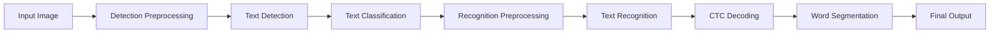

# Client-Side OCR v2.0 - API Reference with RapidOCR Integration

## Table of Contents
1. [Core API](#core-api)
2. [RapidOCR Engine](#rapidocr-engine)
3. [Type Definitions](#type-definitions)
4. [React Components](#react-components)
5. [Configuration Options](#configuration-options)
6. [Language Support](#language-support)
7. [Processing Pipeline](#processing-pipeline)
8. [Error Handling](#error-handling)
9. [Events](#events)
10. [Utilities](#utilities)
11. [Migration Guide](#migration-guide)

## Core API

### createRapidOCREngine(config)

Creates a new RapidOCR engine instance with language and model configuration.

```typescript
function createRapidOCREngine(config: RapidOCRConfig): RapidOCREngine

interface RapidOCRConfig {
  language: LangType;              // Required: Language code
  modelVersion?: ModelVersion;     // Optional: 'PP-OCRv4' | 'PP-OCRv5'
  modelType?: ModelType;          // Optional: 'mobile' | 'server'
  onDownloadProgress?: (progress: DownloadProgress) => void;
}

type LangType = 'ch' | 'en' | 'fr' | 'de' | 'ja' | 'ko' | 'ru' | 
                'pt' | 'es' | 'it' | 'id' | 'vi' | 'fa' | 'ka';
```

### createOCREngine(config?) [Legacy]

Creates a legacy OCR engine instance for backward compatibility.

```typescript
function createOCREngine(config?: OCREngineConfig): OCREngine
```

#### Parameters

- `config` (optional): Configuration options for the OCR engine

```typescript
interface OCREngineConfig {
  wasmPaths?: {
    'ort-wasm.wasm'?: string;
    'ort-wasm-simd.wasm'?: string;
    'ort-wasm-threaded.wasm'?: string;
    'ort-wasm-simd-threaded.wasm'?: string;
  };
  workerPath?: string;
  modelBasePath?: string;
  enableDebug?: boolean;
}
```

#### Returns

- `OCREngine` instance

#### Example

```typescript
import { createOCREngine } from 'client-side-ocr';

// RapidOCR with language selection
const ocr = createRapidOCREngine({
  language: 'en',
  modelVersion: 'PP-OCRv4',
  modelType: 'mobile',
  onDownloadProgress: (progress) => {
    console.log(`Downloaded: ${progress.loaded}/${progress.total} bytes`);
  }
});

// Legacy API for backward compatibility
const ocrLegacy = createOCREngine({
  modelBasePath: '/custom/models/',
  enableDebug: true
});
```

## RapidOCR Engine

The main RapidOCR processing engine with multi-language support and advanced processing techniques.

### RapidOCREngine

#### Methods

##### initialize()

Initializes the OCR engine and downloads required models if not cached.

```typescript
async initialize(): Promise<void>
```

**Example:**
```typescript
// Models auto-download based on language config
await ocr.initialize();

// Check download progress
const ocr = createRapidOCREngine({
  language: 'ja',
  onDownloadProgress: (progress) => {
    console.log(`Progress: ${progress.percent}%`);
  }
});
await ocr.initialize();
```

##### processImage(input, options?)

Process an image and extract text with RapidOCR techniques.

```typescript
async processImage(
  input: File | Blob | ImageData | HTMLImageElement | HTMLCanvasElement,
  options?: ProcessOptions
): Promise<RapidOCRResult>

interface ProcessOptions {
  enableTextClassification?: boolean;  // Enable 180° rotation detection
  enableWordSegmentation?: boolean;     // Enable word-level segmentation
  preprocessConfig?: PreprocessConfig;
  postprocessConfig?: PostprocessConfig;
}
```

**Parameters:**
- `input`: The image to process
- `options` (optional): Processing configuration

**Returns:** `OCRResult` object

**Example:**
```typescript
// Process with RapidOCR techniques
const result = await ocr.processImage(file, {
  enableTextClassification: true,  // 180° rotation detection
  enableWordSegmentation: true,     // Word-level boxes
  preprocessConfig: {
    detectImageNetNorm: true,       // ImageNet normalization
    recStandardNorm: true           // Standard normalization
  },
  postprocessConfig: {
    unclipRatio: 2.0,              // Text region expansion
    boxThresh: 0.7                  // Box confidence threshold
  }
});

console.log(result.text);           // Extracted text
console.log(result.wordBoxes);      // Word-level segmentation
console.log(result.angle);          // Detected rotation
```

##### processImageData(imageData, options?)

Process raw image data.

```typescript
async processImageData(
  imageData: ArrayBuffer | Uint8Array,
  options?: ProcessingOptions
): Promise<OCRResult>
```

**Parameters:**
- `imageData`: Raw image data
- `options` (optional): Processing configuration

**Example:**
```typescript
const response = await fetch('image.jpg');
const data = await response.arrayBuffer();
const result = await ocr.processImageData(data);
```

##### areModelsAvailable()

Checks if models for the configured language are available in cache.

```typescript
async areModelsAvailable(): Promise<boolean>
```

**Example:**
```typescript
if (!await ocr.areModelsAvailable()) {
  console.log('Models will be downloaded on first use');
}
```

##### downloadModels(options?)

Manually download models with optional force flag.

```typescript
async downloadModels(options?: { force?: boolean }): Promise<void>
```

**Example:**
```typescript
// Pre-download models
await ocr.downloadModels();

// Force re-download
await ocr.downloadModels({ force: true });
```

##### isInitialized()

Check if the engine is initialized.

```typescript
isInitialized(): boolean
```

**Returns:** `true` if initialized, `false` otherwise

**Example:**
```typescript
if (!ocr.isInitialized()) {
  await ocr.initialize();
}
```

##### getCurrentModel()

Get information about the current model.

```typescript
getCurrentModel(): ModelConfig | null
```

**Returns:** Current model configuration or `null` if not initialized

**Example:**
```typescript
const model = ocr.getCurrentModel();
console.log(`Using ${model.name} (${model.version})`);
```

##### getAvailableModels()

Get list of available models.

```typescript
getAvailableModels(): ModelConfig[]
```

**Returns:** Array of available model configurations

**Example:**
```typescript
const models = ocr.getAvailableModels();
models.forEach(model => {
  console.log(`${model.name}: ${model.description}`);
});
```

##### getPerformanceMetrics()

Get performance metrics.

```typescript
getPerformanceMetrics(): PerformanceMetrics
```

**Returns:** Performance metrics object

**Example:**
```typescript
const metrics = ocr.getPerformanceMetrics();
console.log(`Model load time: ${metrics.modelLoadTime}ms`);
console.log(`Average processing: ${metrics.avgInferenceTime}ms`);
```

##### destroy()

Cleanup resources and terminate workers.

```typescript
destroy(): void
```

**Example:**
```typescript
// Clean up when done
ocr.destroy();

// In React
useEffect(() => {
  return () => ocr.destroy();
}, []);
```

## Type Definitions

### RapidOCRResult

The result object returned by `processImage()`.

```typescript
interface RapidOCRResult {
  text: string;                    // Full extracted text
  confidence: number;              // Overall confidence (0-1)
  lines: TextLine[];               // Individual text lines
  wordBoxes?: WordSegmentation[];  // Word-level segmentation (if enabled)
  angle?: number;                  // Detected rotation (0 or 180)
  processingTime: ProcessingTime;  // Time breakdown
  raw?: {                         // Raw outputs from each stage
    detection: DetectionOutput;
    classification?: ClassificationOutput;
    recognition: RecognitionOutput;
  };
}

interface ProcessingTime {
  total: number;
  detection: number;
  classification?: number;
  recognition: number;
  preprocessing?: number;
  postprocessing?: number;
}
```

### TextLine

Individual text line information with enhanced confidence metrics.

```typescript
interface TextLine {
  text: string;
  confidence: number;
  box: BoundingBox;
  words?: WordInfo[];  // If word segmentation enabled
}

interface BoundingBox {
  topLeft: Point;
  topRight: Point;
  bottomRight: Point;
  bottomLeft: Point;
}

interface Point {
  x: number;
  y: number;
}

interface WordInfo {
  text: string;
  position: number[];
  confidence: number;
  state: 'cn' | 'en&num';  // Chinese or English/numbers
}
```

### Word

Individual word information.

```typescript
interface Word {
  text: string;
  confidence: number;
  boundingBox: number[][];
}
```

### Configuration Types

#### PreprocessConfig

Controls preprocessing behavior for different stages.

```typescript
interface PreprocessConfig {
  // Detection preprocessing
  detectImageNetNorm?: boolean;     // Use ImageNet normalization (default: true)
  detectLimitSideLen?: number;      // Max side length for detection (default: 736)
  detectLimitType?: 'min' | 'max';  // Limit type (default: 'min')
  
  // Recognition preprocessing  
  recStandardNorm?: boolean;        // Use standard normalization (default: true)
  recImageShape?: [number, number, number]; // [C, H, W] (default: [3, 48, 320])
  
  // Classification preprocessing
  clsImageShape?: [number, number, number]; // [C, H, W] (default: [3, 48, 192])
  clsBatchNum?: number;             // Batch size for classification (default: 6)
}
```

#### PostprocessConfig

Controls postprocessing behavior.

```typescript
interface PostprocessConfig {
  // DB postprocessing for detection
  dbThresh?: number;          // Binarization threshold (default: 0.3)
  boxThresh?: number;         // Box score threshold (default: 0.7)
  unclipRatio?: number;       // Expansion ratio (default: 2.0)
  maxCandidates?: number;     // Max text regions (default: 1000)
  useDbDilation?: boolean;    // Use morphological dilation (default: false)
  
  // CTC decoding for recognition
  ctcBlankIndex?: number;     // Blank token index (default: 0)
  removeBlank?: boolean;      // Remove blank tokens (default: true)
  removeDuplicate?: boolean;  // Remove duplicates (default: true)
}
```

### ModelConfig

Model configuration information.

```typescript
interface ModelConfig {
  id: string;                    // Model identifier
  name: string;                  // Display name
  version: string;               // Model version
  description: string;           // Model description
  type: 'mobile' | 'server';     // Model type
  size: number;                  // Total size in bytes
  languages: string[];           // Supported languages
  files: {
    detection: string;
    recognition: string;
    classification?: string;
    dictionary: string;
  };
  performance: {
    speed: 'fast' | 'medium' | 'slow';
    accuracy: 'good' | 'high' | 'very high';
    memoryUsage: 'low' | 'medium' | 'high';
  };
}
```

### PerformanceMetrics

Performance tracking information.

```typescript
interface PerformanceMetrics {
  modelLoadTime: number;         // Model loading time (ms)
  avgInferenceTime: number;      // Average processing time (ms)
  totalProcessed: number;        // Total images processed
  successRate: number;           // Success rate (0-1)
  lastProcessingTime: number;    // Last processing time (ms)
  memoryUsage?: {
    current: number;             // Current memory (MB)
    peak: number;                // Peak memory (MB)
  };
}
```

## React Components

### RapidOCRInterface

A complete OCR interface component with UI controls and language selection.

```tsx
import { RapidOCRInterface } from 'client-side-ocr/react';

interface RapidOCRInterfaceProps {
  defaultLanguage?: LangType;
  modelVersion?: ModelVersion;
  modelType?: ModelType;
  onResult?: (result: RapidOCRResult) => void;
  onError?: (error: Error) => void;
  enableWordSegmentation?: boolean;
  enableTextClassification?: boolean;
  showSettings?: boolean;
  showModelDownload?: boolean;
  theme?: 'light' | 'dark';
}
```

**Example:**
```tsx
function App() {
  return (
    <RapidOCRInterface
      defaultLanguage="en"
      modelVersion="PP-OCRv4"
      onResult={(result) => {
        console.log('Extracted text:', result.text);
        console.log('Confidence:', result.confidence);
        console.log('Word boxes:', result.wordBoxes);
      }}
      onError={(error) => {
        console.error('OCR error:', error);
      }}
      enableWordSegmentation={true}
      showSettings={true}
    />
  );
}
```

### LanguageSelector

Standalone language selection component.

```tsx
interface LanguageSelectorProps {
  value: LangType;
  onChange: (language: LangType) => void;
  disabled?: boolean;
  showFlags?: boolean;
}
```

### ModelDownloadProgress

Progress indicator for model downloads.

```tsx
interface ModelDownloadProgressProps {
  language: LangType;
  progress: DownloadProgress;
  onCancel?: () => void;
}
```

### useOCR Hook [Legacy]

React hook for OCR functionality.

```typescript
function useOCR(config?: OCREngineConfig): {
  ocr: OCREngine | null;
  isInitialized: boolean;
  isProcessing: boolean;
  error: Error | null;
  result: OCRResult | null;
  processImage: (input: File | Blob, options?: ProcessingOptions) => Promise<void>;
  switchModel: (modelId: string) => Promise<void>;
  reset: () => void;
}
```

**Example:**
```tsx
import { useOCR } from 'client-side-ocr/react';

function OCRComponent() {
  const { ocr, isProcessing, result, processImage, error } = useOCR();

  const handleFileSelect = async (e: React.ChangeEvent<HTMLInputElement>) => {
    const file = e.target.files?.[0];
    if (file) {
      await processImage(file);
    }
  };

  return (
    <div>
      <input type="file" onChange={handleFileSelect} disabled={isProcessing} />
      {isProcessing && <p>Processing...</p>}
      {result && <pre>{result.text}</pre>}
      {error && <p>Error: {error.message}</p>}
    </div>
  );
}
```

## Language Support

### Supported Languages

RapidOCR v2.0 supports 14+ languages:

| Language | Code | PP-OCRv4 | PP-OCRv5 | Script Type |
|----------|------|----------|------------|-------------|
| Chinese | ch | ✅ | ✅ | Simplified & Traditional |
| English | en | ✅ | ✅ | Latin |
| French | fr | ✅ | ❌ | Latin |
| German | de | ✅ | ❌ | Latin |
| Japanese | ja | ✅ | ✅ | Mixed (Hiragana, Katakana, Kanji) |
| Korean | ko | ✅ | ✅ | Hangul |
| Russian | ru | ✅ | ❌ | Cyrillic |
| Portuguese | pt | ✅ | ❌ | Latin |
| Spanish | es | ✅ | ❌ | Latin |
| Italian | it | ✅ | ❌ | Latin |
| Indonesian | id | ✅ | ❌ | Latin |
| Vietnamese | vi | ✅ | ❌ | Latin with tone marks |
| Persian | fa | ✅ | ❌ | Arabic (RTL) |
| Kannada | ka | ✅ | ❌ | Indic |

### Language-Specific Configuration

```typescript
// Japanese with specific settings
const ocrJapanese = createRapidOCREngine({
  language: 'ja',
  modelVersion: 'PP-OCRv4',
  preprocessConfig: {
    recImageShape: [3, 48, 480]  // Wider for complex characters
  }
});

// Persian with RTL support
const ocrPersian = createRapidOCREngine({
  language: 'fa',
  postprocessConfig: {
    reverseText: true  // Handle right-to-left text
  }
});
```

## Processing Pipeline

### RapidOCR Processing Stages



### Stage Details

1. **Detection Preprocessing**
   - ImageNet normalization: mean=[0.485, 0.456, 0.406], std=[0.229, 0.224, 0.225]
   - Dynamic resolution adjustment (multiples of 32)

2. **Text Detection**
   - DB (Differentiable Binarization) algorithm
   - Unclip ratio for text region expansion

3. **Text Classification**
   - 180° rotation detection
   - Batch processing with aspect ratio sorting

4. **Recognition Preprocessing**
   - Standard normalization: (pixel/255 - 0.5) / 0.5
   - Dynamic width calculation

5. **CTC Decoding**
   - Duplicate removal
   - Blank token handling
   - Embedded dictionary support

6. **Word Segmentation**
   - Separates Chinese characters from English/numbers
   - Position tracking for each word

## Configuration Options

### Global Configuration

Set global configuration options.

```typescript
import { setGlobalConfig } from 'client-side-ocr';

setGlobalConfig({
  debug: true,
  defaultModel: 'ppocr-v4',
  wasmThreads: 4,
  cacheModels: true,
  corsProxy: 'https://cors-proxy.example.com/'
});
```

### Debug Mode

Enable debug logging.

```typescript
import { setDebugMode } from 'client-side-ocr';

// Enable debug mode
setDebugMode(true);

// With custom logger
setDebugMode(true, (level, message, data) => {
  console.log(`[${level}] ${message}`, data);
});
```

## Error Handling

### Error Types

```typescript
class RapidOCRError extends Error {
  code: ErrorCode;
  details?: any;
}

enum ErrorCode {
  MODEL_LOAD_FAILED = 'MODEL_LOAD_FAILED',
  MODEL_NOT_FOUND = 'MODEL_NOT_FOUND',
  INVALID_INPUT = 'INVALID_INPUT',
  PROCESSING_FAILED = 'PROCESSING_FAILED',
  WORKER_ERROR = 'WORKER_ERROR',
  NETWORK_ERROR = 'NETWORK_ERROR',
  UNSUPPORTED_LANGUAGE = 'UNSUPPORTED_LANGUAGE',
  DOWNLOAD_FAILED = 'DOWNLOAD_FAILED',
  BROWSER_NOT_SUPPORTED = 'BROWSER_NOT_SUPPORTED'
}
```

### Error Handling Example

```typescript
try {
  const result = await ocr.processImage(file);
} catch (error) {
  if (error instanceof RapidOCRError) {
    switch (error.code) {
      case ErrorCode.MODEL_NOT_FOUND:
        console.log('Downloading models...');
        await ocr.downloadModels();
        break;
      case ErrorCode.UNSUPPORTED_LANGUAGE:
        console.error('Language not supported:', error.details);
        break;
      case ErrorCode.DOWNLOAD_FAILED:
        console.error('Model download failed, check network');
        break;
      default:
        console.error('OCR error:', error.message);
    }
  }
}
```

## Events

### Event Types

```typescript
interface RapidOCREvents {
  'modelDownloadStart': { language: string; models: string[] };
  'modelDownloadProgress': { progress: DownloadProgress };
  'modelDownloadComplete': { language: string };
  'modelLoading': { stage: 'detection' | 'classification' | 'recognition' };
  'modelLoaded': { stage: string; loadTime: number };
  'processingStart': { timestamp: number };
  'processingStage': { stage: string; progress: number };
  'processingComplete': { result: RapidOCRResult };
  'error': { error: RapidOCRError };
}
```

### Event Handling

```typescript
const ocr = createRapidOCREngine({ language: 'en' });

// Model download events
ocr.on('modelDownloadProgress', ({ progress }) => {
  console.log(`Download: ${progress.percent}%`);
});

// Processing stage events
ocr.on('processingStage', ({ stage, progress }) => {
  console.log(`${stage}: ${progress}%`);
});

// Complete processing
ocr.on('processingComplete', ({ result }) => {
  console.log('Text:', result.text);
  console.log('Processing time:', result.processingTime);
});
```

## Utilities

### Model Management

```typescript
import { ModelCache } from 'client-side-ocr/utils';

// Check cached models
const cache = new ModelCache();
const cachedModels = await cache.listCachedModels();
console.log('Cached models:', cachedModels);

// Clear specific language models
await cache.clearLanguage('en');

// Clear all cached models
await cache.clearAll();

// Get cache size
const size = await cache.getCacheSize();
console.log(`Cache size: ${size.totalMB}MB`);
```

### checkCompatibility()

Check browser compatibility with enhanced feature detection.

```typescript
import { checkCompatibility } from 'client-side-ocr';

const compatibility = await checkCompatibility();

if (!compatibility.supported) {
  console.error('Missing features:', compatibility.missingFeatures);
} else {
  console.log('Supported features:', {
    webgl: compatibility.features.webgl,
    wasm: compatibility.features.wasm,
    webWorkers: compatibility.features.webWorkers,
    offscreenCanvas: compatibility.features.offscreenCanvas,
    sharedArrayBuffer: compatibility.features.sharedArrayBuffer
  });
}
```

### optimizeImage()

Optimize image for OCR processing.

```typescript
import { optimizeImage } from 'client-side-ocr';

const optimized = await optimizeImage(file, {
  maxDimension: 2048,
  quality: 0.9,
  format: 'jpeg',
  grayscale: true
});

const result = await ocr.processImage(optimized);
```

### preprocessImage()

Apply preprocessing filters.

```typescript
import { preprocessImage } from 'client-side-ocr';

const processed = await preprocessImage(file, {
  contrast: 1.5,
  brightness: 1.1,
  sharpen: true,
  denoise: true
});
```

### extractRegion()

Extract a specific region from an image.

```typescript
import { extractRegion } from 'client-side-ocr';

const region = await extractRegion(image, {
  x: 100,
  y: 100,
  width: 200,
  height: 50
});

const result = await ocr.processImage(region);
```

## Advanced Usage

### Custom Model URLs

```typescript
const ocr = createRapidOCREngine({
  language: 'en',
  modelUrls: {
    detection: 'https://your-cdn.com/models/det.onnx',
    recognition: 'https://your-cdn.com/models/rec.onnx',
    classification: 'https://your-cdn.com/models/cls.onnx',
    dictionary: 'https://your-cdn.com/models/dict.txt'
  }
});
```

### Web Worker Configuration

```typescript
const ocr = createRapidOCREngine({
  language: 'en',
  workerConfig: {
    detectionWorkerUrl: '/workers/detection.worker.js',
    recognitionWorkerUrl: '/workers/recognition.worker.js',
    classificationWorkerUrl: '/workers/classification.worker.js',
    terminateOnIdle: true,
    idleTimeout: 30000 // 30 seconds
  }
});
```

### Batch Processing

```typescript
// Process multiple images efficiently
const images = [file1, file2, file3];
const results = await Promise.all(
  images.map(img => ocr.processImage(img))
);

// Or with shared configuration
const batchResults = await ocr.processBatch(images, {
  enableWordSegmentation: true,
  preprocessConfig: {
    detectImageNetNorm: true,
    recStandardNorm: true
  }
});

// Batch processing with progress
for (let i = 0; i < images.length; i++) {
  const result = await ocr.processImage(images[i]);
  console.log(`Progress: ${i + 1}/${images.length}`);
}
```

### Stream Processing

```typescript
import { createOCRStream } from 'client-side-ocr';

const stream = createOCRStream();

stream.on('result', (result) => {
  console.log('OCR Result:', result.text);
});

// Process video frames
const video = document.querySelector('video');
const canvas = document.createElement('canvas');
const ctx = canvas.getContext('2d');

setInterval(() => {
  ctx.drawImage(video, 0, 0);
  canvas.toBlob((blob) => {
    stream.process(blob);
  });
}, 1000);
```

### Custom Model Loading

```typescript
import { registerCustomModel } from 'client-side-ocr';

// Register a custom model
registerCustomModel({
  id: 'custom-model',
  name: 'Custom Model',
  version: '1.0',
  files: {
    detection: '/models/custom/det.onnx',
    recognition: '/models/custom/rec.onnx',
    dictionary: '/models/custom/dict.txt'
  }
});

// Use the custom model
const ocr = createOCREngine();
await ocr.initialize('custom-model');
```

## Performance Optimization

### Memory Management

```typescript
import { setMemoryLimit, getMemoryUsage } from 'client-side-ocr';

// Set memory limit (MB)
setMemoryLimit(512);

// Monitor memory usage
const usage = getMemoryUsage();
console.log(`Memory: ${usage.current}MB / ${usage.limit}MB`);

// Auto cleanup when memory is high
ocr.on('memoryWarning', () => {
  ocr.clearCache();
});
```

### Caching

```typescript
import { setCacheStrategy } from 'client-side-ocr';

// Configure caching
setCacheStrategy({
  models: true,          // Cache loaded models
  results: true,         // Cache OCR results
  maxSize: 100,          // Max cache size (MB)
  ttl: 3600000          // Cache TTL (1 hour)
});

// Clear cache
ocr.clearCache('models');
ocr.clearCache('results');
ocr.clearCache(); // Clear all
```

## Migration Guide

### From v1.x to v2.0

```typescript
// v1.x
const ocr = createOCREngine();
await ocr.initialize('ppocr-v4');
const result = await ocr.processImage(file);

// v2.0
const ocr = createRapidOCREngine({
  language: 'en',
  modelVersion: 'PP-OCRv4'
});
await ocr.initialize();
const result = await ocr.processImage(file);
```

### Component Migration

```tsx
// v1.x
import { OCRInterface } from 'client-side-ocr/react';
<OCRInterface />

// v2.0
import { RapidOCRInterface } from 'client-side-ocr/react';
<RapidOCRInterface defaultLanguage="en" />
```

### Model Name Mapping

| v1.x | v2.0 Configuration |
|------|-------------------|
| `ppocr-v4` | `{ modelVersion: 'PP-OCRv4', modelType: 'mobile' }` |
| `ppocr-v5` | `{ modelVersion: 'PP-OCRv5', modelType: 'mobile' }` |
| `en-mobile` | `{ language: 'en', modelType: 'mobile' }` |
| `ppocr-v2-server` | `{ modelVersion: 'PP-OCRv4', modelType: 'server' }` |

For a complete migration guide, see [MIGRATION.md](./MIGRATION.md).

## Performance Tips

### 1. Model Selection

- **Mobile models**: Fast, smaller size, good for real-time processing
- **Server models**: Higher accuracy, larger size, better for batch processing

### 2. Image Preprocessing

```typescript
// Resize large images for better performance
const maxSize = 1920;
const resizedImage = await resizeImage(originalImage, maxSize);

// Use appropriate preprocessing
const result = await ocr.processImage(resizedImage, {
  preprocessConfig: {
    detectLimitSideLen: 1280  // Limit detection resolution
  }
});
```

### 3. Memory Management

```typescript
// Process and release immediately
for (const image of largeImageSet) {
  const result = await ocr.processImage(image);
  await processResult(result);
  
  // Force garbage collection hint
  if (global.gc) global.gc();
}

// Destroy engine when done
ocr.destroy();
```

## Troubleshooting

### Common Issues

1. **SharedArrayBuffer not available**
   ```javascript
   // Add these headers to your server
   response.headers.set('Cross-Origin-Embedder-Policy', 'require-corp');
   response.headers.set('Cross-Origin-Opener-Policy', 'same-origin');
   ```

2. **CORS errors with models**
   ```javascript
   // Configure CORS for model files
   const ocr = createOCREngine({
     corsProxy: 'https://cors-anywhere.herokuapp.com/'
   });
   ```

3. **Out of memory errors**
   ```javascript
   // Use smaller models or optimize images
   const optimized = await optimizeImage(file, { maxDimension: 1024 });
   const result = await ocr.processImage(optimized);
   ```

## Best Practices

1. **Choose the right language and model**
   ```typescript
   // For documents with mixed languages
   const ocr = createRapidOCREngine({
     language: 'en',  // Primary language
     modelVersion: 'PP-OCRv4'  // Better multi-language support
   });
   ```

2. **Enable features based on content**
   ```typescript
   // For scanned documents
   const result = await ocr.processImage(file, {
     enableTextClassification: true,  // Fix upside-down text
     enableWordSegmentation: true,     // Better for mixed languages
   });
   ```

2. **Handle errors gracefully**
   ```typescript
   try {
     const result = await ocr.processImage(file);
   } catch (error) {
     // Fallback to server-side OCR
     const result = await serverOCR(file);
   }
   ```

3. **Monitor model downloads**
   ```typescript
   const ocr = createRapidOCREngine({
     language: 'ja',
     onDownloadProgress: (progress) => {
       updateProgressBar(progress.percent);
     }
   });
   
   // Pre-download for offline use
   await ocr.downloadModels();
   ```

## License

MIT License - see [LICENSE](https://github.com/siva-sub/client-ocr/blob/main/LICENSE)

## Support

- GitHub Issues: [https://github.com/siva-sub/client-ocr/issues](https://github.com/siva-sub/client-ocr/issues)
- Discussions: [https://github.com/siva-sub/client-ocr/discussions](https://github.com/siva-sub/client-ocr/discussions)
- Email: sivasub987@gmail.com